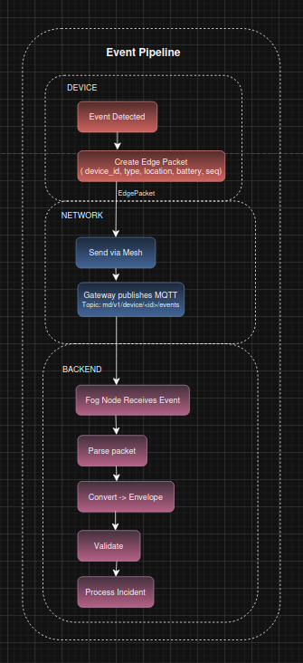
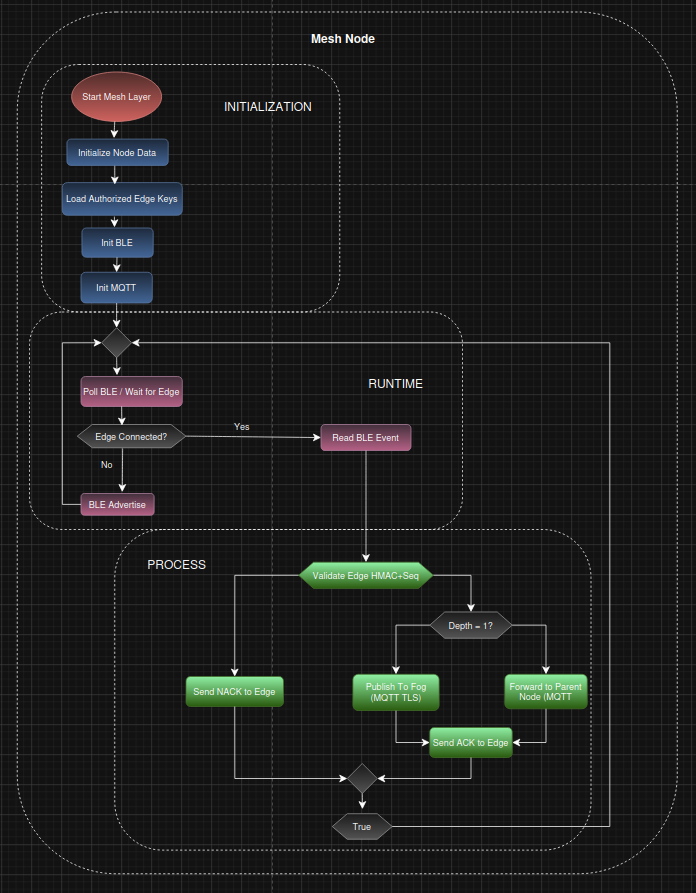
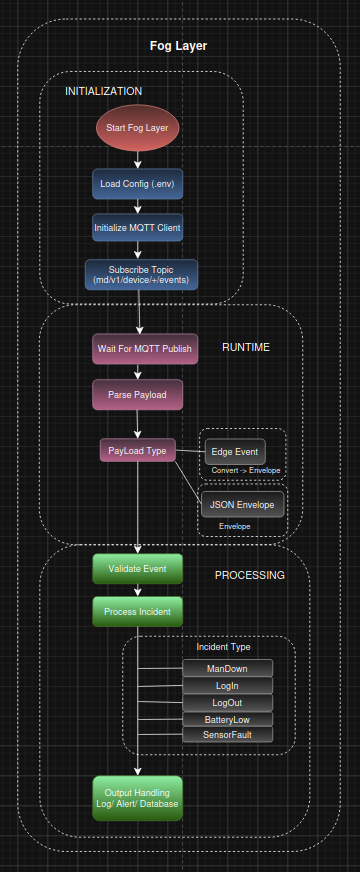

# Man-Down IoT Safety System

A distributed industrial safety system designed for **real-time incident detection**, **low-latency response**, and **privacy-preserving data handling**.

The system detects critical events (e.g. falls) and ensures rapid response without relying on cloud infrastructure.

---

## Overview

Each worker carries a small **edge device** that monitors motion and detects incidents such as:

- Falls (`man_down`)
- Low battery
- Sensor faults
- Connectivity loss

When an event occurs, it is transmitted through a **secure mesh network** to a **local fog server**, where it is validated, classified, and acted upon.

> The system is designed as a **safety system**, not a tracking or surveillance platform.

---

## System Architecture

The system consists of three layers:

[Edge-Layer] -> [Mesh-Network] -> [Fog-Layer] 

- **Edge Layer** – Wearable embedded device (ESP32)  
- **Network Layer** – WiFi mesh + BLE communication  
- **Fog Layer** – Local backend (Rust + MQTT + encrypted DB)  

> No cloud services are used or required for system operation.

### Key Design Principles

- Event-driven architecture  
- Fully local operation (fog computing)  
- Low latency  
- High fault tolerance  
- Strong security and encryption  

---

## Event Pipeline

This diagram shows how an event moves through the system from detection to action.

1. Event detected on edge device  
2. Binary packet created  
3. Sent via BLE → Mesh node  
4. Forwarded via mesh → MQTT (TLS)  
5. Received in fog layer  
6. Parsed → validated → classified  
7. Stored and/or triggers alert  

---

## Architecture Overview

The system is built as a **fully local, event-driven architecture** consisting of three layers:

- **Edge Layer** – Detects incidents and generates events  
- **Network Layer** – Transports events through a resilient mesh network  
- **Fog Layer** – Validates, processes, and stores safety-critical data  

All communication flows from edge devices → mesh network → fog layer using secure and lightweight protocols.

> The system operates entirely locally and does not depend on any cloud services.

### Data Flow Summary

1. Edge device detects an event  
2. Event is encoded into a compact binary packet  
3. Packet is sent via BLE to nearest mesh node  
4. Mesh network routes the message (multi-hop)  
5. Gateway node publishes event via MQTT (TLS)  
6. Fog layer receives and processes the event  

---

## Edge Layer (ESP32, C + FreeRTOS)

Wearable embedded device responsible for **event detection**, **local safety feedback**, and **secure transmission**.

 [Detailed documentation](edge/README.md)

### Responsibilities

- Accelerometer-based fall detection  
- Local alarm (buzzer + LED)  
- Heartbeat (every 10 seconds)  
- Battery monitoring  
- Secure BLE communication  
- Dynamic node selection (RSSI-based)  
- Retry + ACK-based transmission  
- Temporary blacklist for unstable nodes  

### Communication Flow

1. Scan for nodes  
2. Connect to strongest signal  
3. Send event packet  
4. Wait for ACK  
5. Disconnect  

### Security

- HMAC signing of all packets  
- Sequence numbers (anti-replay protection)  

### Critical Constraint

All sensor data:

- Exists only in RAM  
- Is never written to flash  
- Is never stored persistently  
- Is never transmitted unless a qualifying event occurs  

---

## Network Layer (Mesh)

Hierarchical mesh network responsible for **reliable multi-hop communication** between edge devices and the fog layer.

 [Detailed documentation](mesh_node/README.md)

### Architecture

- Hierarchical mesh over WiFi  
- Nodes organized by depth  
- Parent-child routing  

### Features

- Multi-hop communication  
- Backup parent nodes  
- BLE interface for edge devices  

### Responsibilities

- Receive edge events via BLE  
- Validate HMAC (constant-time comparison)  
- Verify sequence numbers  
- Forward events via MQTT over TLS  

### Security

- TLS with CA certificates  
- Authenticated communication  
- Replay protection  

### Provisioning

Managed from fog layer via MQTT:

- Edge keys  
- Certificates  

Stored securely in EEPROM.

---

## Fog Layer (Rust)

Local backend responsible for **event validation**, **classification**, and **secure storage**.

 [Detailed documentation](fog_node/README.md)

### Components

- **MQTT Broker:** Mosquitto  
- **Backend:** Rust MQTT subscriber  
- **Database:** SQLite (SQLCipher encrypted)  

### Responsibilities

- Subscribe to MQTT topics  
- Parse binary payloads  
- Convert → JSON envelope  
- Validate events  
- Classify incidents  
- Store safety-critical data  
- Trigger alerts  

### MQTT Topic
md1/v/device/+/events

### Incident Types

- `man_down`  
- `battery_low`  
- `sensor_fault`  
- `login` *(planned)*  
- `logout` *(planned)*  

### Processing Pipeline

1. Receive MQTT message  
2. Parse payload  
2. Convert to structured envelope  
4. Validate integrity and sequence  
5. Classify incident  
6. Trigger action (log / alert / store)  

### Performance

- Parallel event processing  
- Low-latency local handling  
- No external dependencies  

---

## Data Storage (Fog)

The system uses:

- **SQLite database**
- **SQLCipher full-database encryption**

### Stored Data (Encrypted)

- `worker_id`  
- `device_id`  
- `event_type`  
- Timestamp  
- Battery level (if relevant)  
- Coarse location / zone hint  
- Validation metadata  

### Not Stored

- Continuous sensor data  
- Movement tracking  
- Location history  
- Behavioral analytics  
- Biometric data  
- Heartbeat logs  

> All non-critical data is processed transiently and discarded immediately.

---

## Security Model

### Edge → Node

- HMAC verification  
- Sequence numbers (anti-replay)  

### Node → Fog

- MQTT over TLS  
- CA certificate validation  

### Storage

- SQLCipher encryption  
- Secure key handling  
- No sensitive data on edge devices  

---

## Identity & RFID (Planned)

RFID will be used for:

- Worker check-in (login)  
- Worker check-out (logout)  
- Device association  
- Secure key provisioning  

### Privacy Constraints

- No tracking history  
- No behavioral analytics  
- Only event-based storage  

---

## Failure Handling Guarantees

- **If mesh fails:**  
  → Local alarm remains active  
  → Disconnect event generated  

- **If fog is unavailable:**  
  → Edge operates independently  

- **If MQTT fails:**  
  → Retry mechanism activates  

- **If ACK not received:**  
  → Retries + local escalation  

> Safety never depends on cloud or external services.

---

## Technologies

| Layer        | Technology |
|-------------|-----------|
| Edge        | ESP32, C, FreeRTOS |
| Network     | WiFi Mesh, BLE |
| Protocol    | MQTT |
| Security    | HMAC, TLS |
| Fog Backend | Rust |
| Broker      | Mosquitto |
| Database    | SQLite + SQLCipher |

---

## Privacy & Compliance

The system is designed with:

- Privacy by Design  
- Data Minimization  
- Purpose Limitation (Workplace Safety Only)  
- Incident-Based Persistence  

Supports compliance with:

- GDPR (EU 2016/679)  

> This is a safety system — not a surveillance system.

---

## Future Improvements

- RFID integration (identity + provisioning)  
- Indoor positioning (trilateration)  
- Secure hardware element (key storage)  
- High-availability fog cluster  
- Secure firmware updates  

---

## Contributors

- @sachariasgj
- @raspants
- @daniela1o1

---

